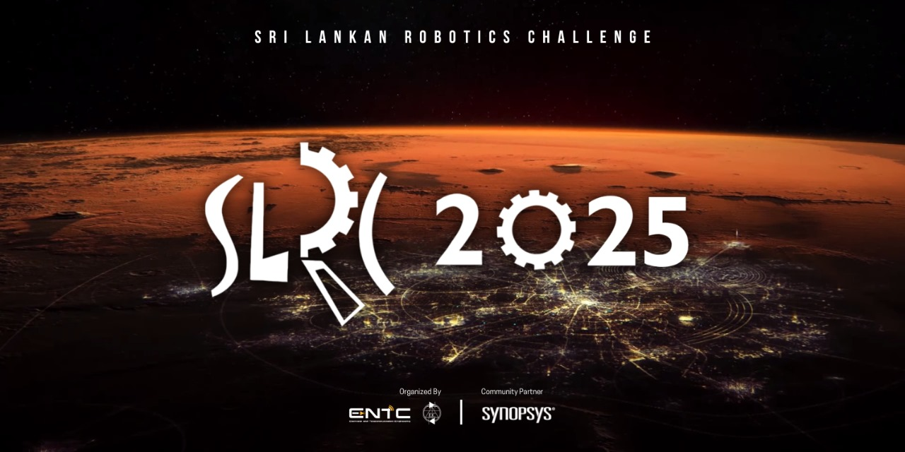

# Sri Lankan Robotics Challenge (SLRC) 2025 - Task

  

Welcome to the official **task repository** for the **Sri Lankan Robotics Challenge (SLRC) 2025**, organized by **E-Club, University of Moratuwa**. SLRC is Sri Lanka’s **premier robotics competition**, bringing together school and university students to showcase their robotics skills in a competitive and innovative environment.  

This repository contains the **official task descriptions, guidelines, and resources** for participants competing in SLRC 2025.  

## Competition Categories
- **School Category** 🏫  
  Designed for school students **under 20 years old**, focusing on fundamental robotics concepts.
  
- **University Category** 🎓  
  Open to undergraduates **under 28 years old**, featuring advanced robotics challenges.

## How to Participate?
📢 **Registrations open on February 10th, 2025!**  
- Visit our official website to register: [SLRC Registration Page](https://ent.uom.lk/slrc/)  
- For updates, join our **WhatsApp Community**: [Join Here](https://chat.whatsapp.com/Hw05TgcbmuMIp2ofnunYWv)  

## Documents & Resources
📄 **Technical Specification Guidelines (Released on February 5th, 2025):**  
- School Category: [`SLRC_School_Category.pdf`](docs/SLRC_School_Category.pdf)  
- University Category: [`SLRC_University_Category.pdf`](docs/SLRC_University_Category.pdf)  

## Stay Connected

Stay updated with the latest announcements and competition details through our official channels:

📌 **SLRC Website**: [ent.uom.lk/slrc](https://ent.uom.lk/slrc)  
📌 **WhatsApp Community**: [Join Here](https://chat.whatsapp.com/Hw05TgcbmuMIp2ofnunYWv)  
📌 **SLRC Facebook Page**: [UoM SLRC](https://facebook.com/UoM.SLRC)  
📌 **SLRC YouTube Channel**: [Sri Lankan Robotics Challenge](https://www.youtube.com/@srilankanroboticschallenge2341)  
📌 **Contact Email**: [slrc@uom.lk](mailto:slrc@uom.lk)  
📌 **LinkedIn**: [Electronic Club UoM](https://www.linkedin.com/company/electronic-club-uom/)  

Follow us for updates, important announcements, and competition-related discussions! 🚀  
